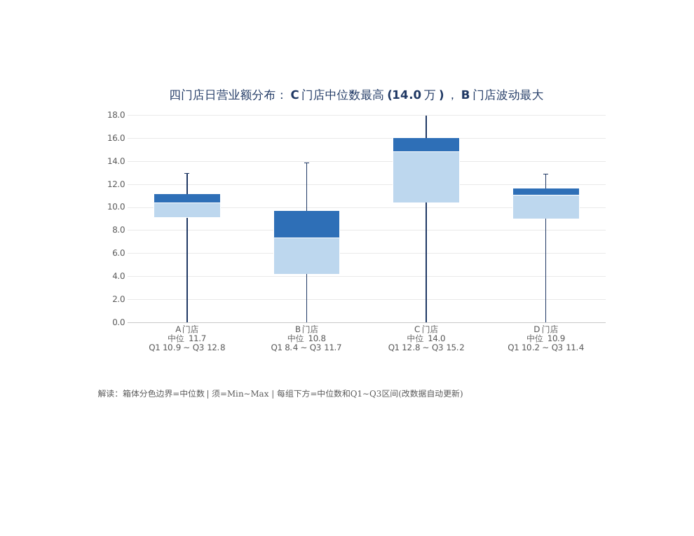
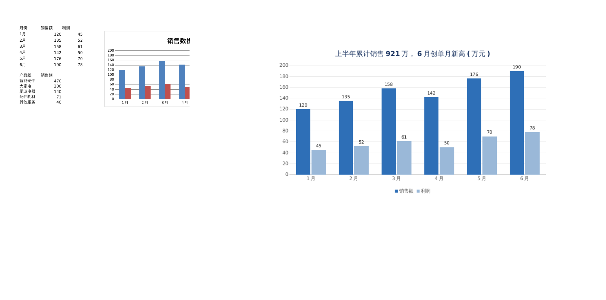
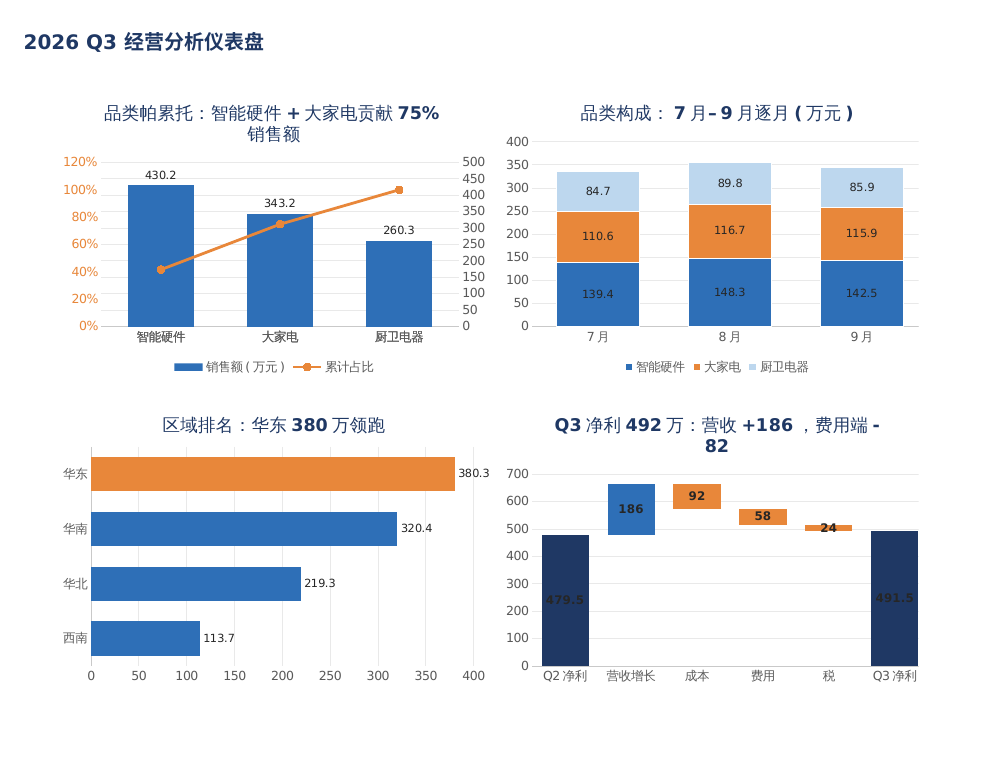

# office-visual-style

> ### 夏制 · Xiazhi
> **让 AI 出的图表，像人做的。**
> 配色系统「盛夏蓝橙」 · 自检闭环「照镜自检」

### Make agent-generated Excel charts & PowerPoint decks look *designed* — not default.
### And never ship a document the agent has never actually seen.

[中文说明见下](#中文说明) · MIT · Excel + PowerPoint + Python

---

## The two problems nobody fixes

1. **Default charts look like Excel 2007.** `openpyxl` and `python-pptx` give you grey grids, harsh colors, "系列1"-style legends, and titles that say *"统计"* instead of the actual story.
2. **Agents deliver blind.** An AI writes a chart it cannot see. Mis-referenced ranges, page-split charts, labels on the wrong bar, and titles that contradict the data all ship straight to the user.

This skill fixes both — and it's not a demo. It was battle-tested across **16 real scenarios** in a single day, where the render-and-inspect loop caught **20+ bugs** that code review alone missed.

---

## ⭐ Capabilities — 10 styled chart types, all native & editable

| Chart | Function | Notes |
|---|---|---|
| Column / Bar | `styled_bar()` | grouped, per-point coloring |
| **Horizontal ranking** | `styled_bar(horizontal=True)` | sorted bars, highlight the leader |
| Line | `styled_line()` | multi-series, smoothed/none |
| Pie | `styled_pie()` | white-outlined slices, first slice highlighted |
| **Box & whisker** ⭐ | `styled_box()` | **native editable** — see below |
| Stacked composition | `styled_stacked()` | palette-mapped segments |
| Combo (dual axis) | `styled_combo()` | bars + line on a real secondary axis |
| Waterfall / bridge | `styled_waterfall()` | per-point colors, real amounts as labels |
| Actual vs Target | `styled_target()` | bars + dashed target line, same axis |
| Doughnut | `styled_donut()` | palette + white borders + % labels |
| Scatter (XY) | `styled_scatter()` | correlation plots, no phantom connecting line |

**Zero-chartEx box plots.** Excel 2016+ box plots are a new `chartEx` format that `openpyxl` **cannot write**. This skill builds a fully editable box-and-whisker the classic way — stacked columns + error bars (transparent Q1 base, two-tone box with the median as the boundary, error bars as the whiskers) — with five-number summaries as category labels.



---

## 👁️ The verification loop — the real differentiator

Generate → **render** → **look** → fix → repeat, until every page is green:

```
openpyxl / python-pptx  →  soffice --headless (→ PDF)  →  pdftoppm (→ PNG)  →  inspect
```

When the vision model is down or times out, three deterministic fallbacks keep the loop alive:

1. `pdftotext -bbox` — exact coordinates for every text word (catches labels sitting on the wrong category)
2. **PIL pixel analysis** — cluster colors by row/column bands (proves the color *logic*, not just the color's existence)
3. **XML structure checks** — unzip the xlsx and grep the chart XML

### `verify_chart.py` — three-layer ship check (v1.7)

One command before you ship an `.xlsx`: **① data layer** (re-open the file and dump every cell, so a duplicate write block that corrupts chart data is caught — *this exact bug cost 7 rounds of rework*), **② structure layer** (every chart's axis `axId↔crossAx` must be paired and closed, or Excel/WPS silently deletes the chart), **③ render layer** (convert to PDF and detect overlapping text boxes per page).

```bash
python3 scripts/verify_chart.py all  file.xlsx   # structure + render
python3 scripts/verify_chart.py dump file.xlsx 数据源  # data layer (eyeball values)
```

Hard rules baked in from real failures: never debug a chart by guessing the viewer's quirks before checking your own file's data; never let two code blocks write the same cells; openpyxl's blank-span option is `display_blanks = 'span'` (the camelCase name silently does nothing).

## 🔗 Excel → PPT pipeline

One dataset, two documents, zero drift: the Excel workbook is the single source of truth, the PPT deck reads it back and re-charts it natively — with **cross-document assertions** that fail the build if any headline number disagrees between the two.

## 🎨 The design system

Five principles, applied automatically: insight-style titles (state the conclusion) · no chart junk · direct data labels · low-saturation professional palette (navy `#1F3864` / blue `#2E6FB7` / orange `#E8873A`) · legends at the bottom.




## Proof: bugs caught by looking, not by reading

- A waterfall series reference that included the category text column → a phantom point shifted every bar one slot and dropped the last bar
- Chart objects added to a **hidden** sheet → silently rendered nowhere
- LibreOffice drops stacked points whose base segment is zero-height → waterfall totals vanished (fixed with an invisible 0.5 base pad)
- A pill "rounding drift" of +7 across 1,104 detail rows → headline totals disagreed between Excel and PPT
- Narrative numbers hard-coded into the deck ("5.0% below target", "14.9M gap") that silently went stale the moment the data changed

## Install

```bash
npx skills add https://github.com/xiaotong2026/office-visual-style --skill office-visual-style
# or copy skills/office-visual-style/ into your agent's skills directory
```

Requirements: `openpyxl`, `python-pptx`, `libreoffice-calc`, `libreoffice-impress`, `poppler-utils`, CJK fonts for Chinese labels.

## Usage

```python
from chart_style import styled_bar, styled_line, styled_pie, styled_box, styled_target, fit_to_page

styled_bar(ws, data_ref, cats_ref, "H1 sales hit 9.21M, June at an all-time high", "E2")
styled_target(ws, actual_ref, target_ref, cats_ref, "Monthly actual vs target", "B3")
styled_box(ws, cats_ref, (q1_ref, lower_ref, upper_ref), "Latency by region", "B2",
           err_refs=(minus_ref, plus_ref))
fit_to_page(ws)   # prevents page-split charts
```

Run any demo: `python3 scripts/demo_bar.py` → outputs land in `output/`.

---

## 中文说明

**给 AI 助手用的 Excel 图表 / PPT 美化标准。** 默认样式是 Excel 2007 既视感，而且 AI "盲写交付"——看不到自己画的图，引用错位、跨页切割、标签错位直接发给用户。

**能画什么**（全部原生可编辑，非贴图）：柱状 / 条形 / **横向排名** / 折线 / 饼图 / **箱形图** / 堆叠构成 / **双轴组合** / **瀑布桥** / 实际vs目标 / 环形 / 散点 —— 共 10 种。

**箱形图是主打**：Excel 2016+ 原生箱形图是 `openpyxl` 写不了的新格式（chartEx），本 skill 用"堆叠柱+误差线"经典手法做出**完全可编辑**的箱线图，五数概括直接标在类别上。

**核心差异化 = 渲染自检闭环**：生成 → LibreOffice 转 PDF → PNG → 逐页过目 → 有问题就修，循环到全绿才交付；视觉模型挂了就用 pdftotext 坐标 / PIL 像素 / XML 结构三重备胎。

**Excel→PPT 同源管线**：一份数据两处成文，跨文档断言卡住"两边数字不一致"。

**实战证明**：一天 16 个场景，自检抓出 20+ 个代码审查漏掉的 bug。

安装：`npx skills add https://github.com/xiaotong2026/office-visual-style --skill office-visual-style`

## License

MIT © 2026 xiaotong2026
